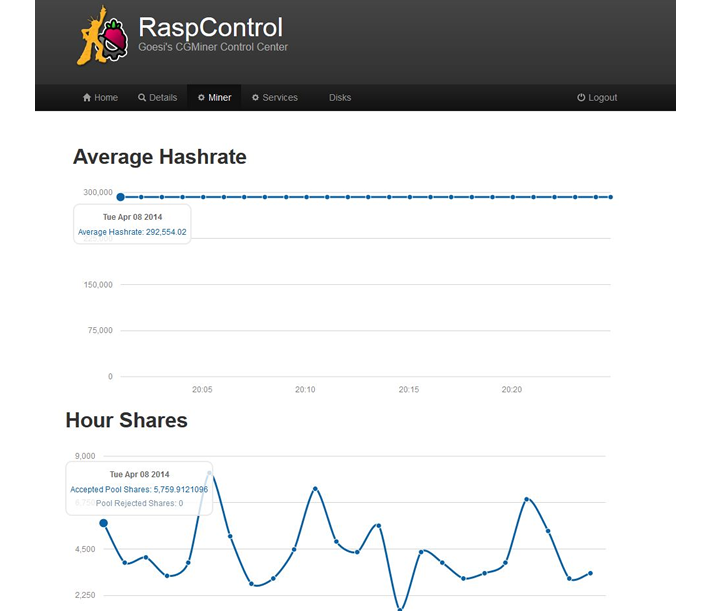

# Raspcontrol

Raspcontrol is a web control centre written in PHP for Raspberry Pi.

Love Raspcontrol? The origional author [@imjacobclark](http://twitter.com/imjacobclark/) is saving up to study Computer Science at University, help him out? Go on [gittip.com/Bioshox](https://www.gittip.com/Bioshox/)

***

## Installation

__The [Installation Guide](https://github.com/Bioshox/Raspcontrol/wiki/Installation-Guide) in now hosted on the wiki.__  
German Installation Guide: (http://sven-goessling.de/12/01/2014/raspcontrol-cgminer-auf-dem-raspberry-pi-11-01-14/)
For the moment, you need a web server (like Apache) installed on your Raspberry Pi.

If you are in a hurry, just clone the repository with:

	git clone https://github.com/djspacedevil/Raspcontrol.git raspcontrol

And create the json authentifation file `/etc/raspcontrol/database.aptmnt` with 777 rights:

	{
 	   "user":       "yourName",
 	   "password":   "yourPassword"
	}

## Optional configuration

In order to have some beautiful URLs, you can enable URL Rewriting.  
Please follow instructions described on the wiki page [Enable URL Rewriting](https://github.com/Bioshox/Raspcontrol/wiki/Enable-URL-Rewriting).

__Note:__ It's not necessary to enable URL Rewriting to use Raspcontrol.

## Cronjob

if you want a automatic update of the cgminer static's you need a cron job.

open /etc/crontab
Insert: 
#CG-Miner Stats
0  *	* * *	www-data	php /var/www/functions/cron_job.php

open /etc/rc.local
Insert:
php /var/www/functions/cron_job.php new